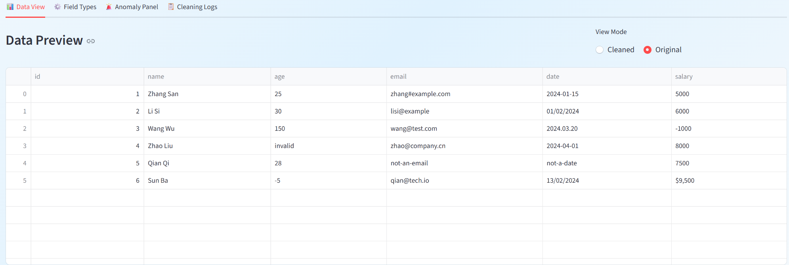
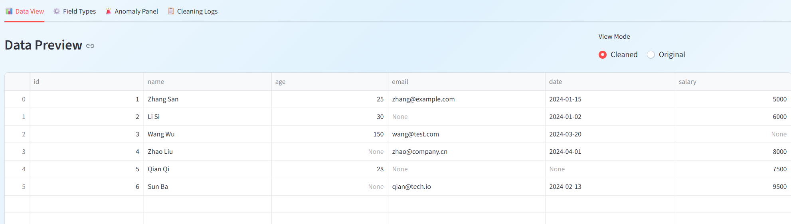

Data Cleaner Pro
一个基于 Streamlit 的数据清洗工具，支持 CSV 和 Excel 文件的智能清洗、异常检测与结构化日志导出。

功能介绍

一、智能字段类型识别
上传数据后，工具会自动识别每一列的数据类型，包括数字、日期、邮箱、布尔值和文本，无需手动配置。

二、数值清洗
自动识别并处理无效占位符（如 unknown、N/A、null）、非数字内容、货币符号（$、￥）和千位分隔符。支持按字段名称自动应用范围规则，例如 age 字段超过 120 或低于 0 会被标记为异常。

三、日期清洗
支持多种日期格式，包括 YYYY-MM-DD、DD/MM/YYYY、MM/DD/YYYY、YYYY.MM.DD 等。当日期存在歧义（如 01/02/2024 无法确定是 1 月 2 日还是 2 月 1 日）时，工具会记录日志并标注提示，供人工核查。

四、邮箱清洗
自动修复常见脏数据（如把 # 替换为 @），清洗后再次验证格式，不合法的邮箱会被记录在日志中。

五、可视化异常面板
清洗完成后，所有异常会展示在异常面板中，包括原始值、清洗后的值、异常类型和原因提示。支持按列和按异常类型过滤。

六、结构化清洗日志
所有清洗操作都会生成 JSON 格式的日志，记录行号、字段名、原始值、处理结果和异常原因，方便追溯和审计。支持一键导出。

清洗前

清洗后

快速开始
安装依赖：
pip install streamlit pandas openpyxl
启动应用：
streamlit run data_refinery.py
浏览器会自动打开，默认地址为 http://localhost:8501

使用步骤

在左侧边栏上传 CSV 或 Excel 文件，或点击 Load Sample Data 加载示例数据
点击 Auto-Detect Field Types 自动识别字段类型
在 Field Types 页面确认字段类型，可选配置数值字段的范围规则
点击 Start Data Cleaning Pipeline 开始清洗
在 Anomaly Panel 查看所有异常，在 Cleaning Logs 查看完整日志
在 Data View 下载清洗后的 CSV 文件

支持的异常类型

超出范围：数值超过字段允许的最大值或最小值
非数值：字段应为数字但内容无法解析
占位符：内容为 unknown、null、N/A 等无效填充值
格式错误：日期或邮箱格式无法识别
日期歧义：日期的月份和日期无法确定顺序
邮箱格式：清洗后仍不符合邮箱格式规范

技术栈

Python 3.x
Streamlit
Pandas
Regex

适用场景
适合需要批量处理业务数据的场景，例如清洗 CRM 导出数据、处理用户注册信息、整理财务或 HR 报表中的脏数据。相比手动用 Excel 处理，本工具可以自动发现问题并保留完整的处理记录。
